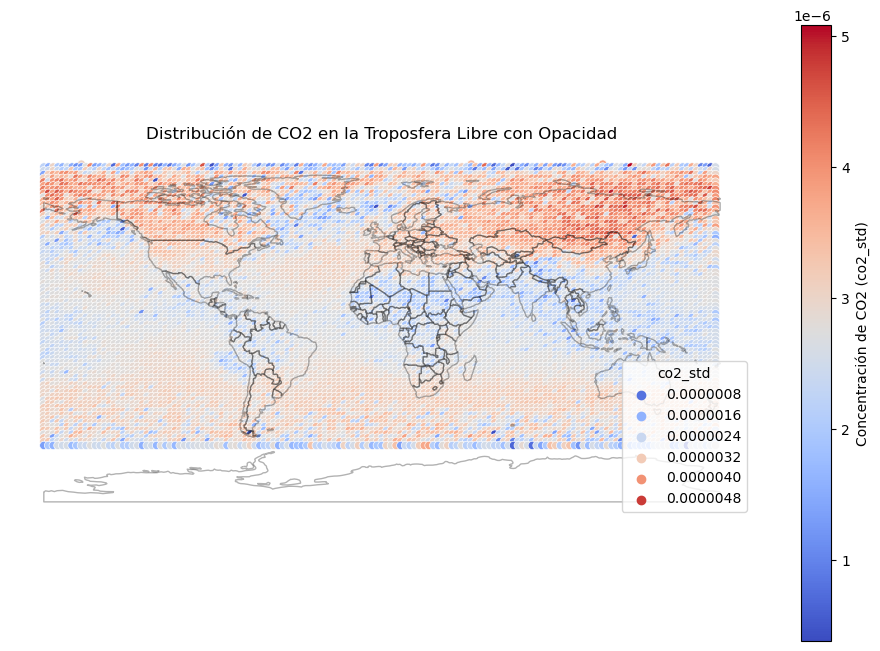

# Análisis Geoestadístico de Productos de CO2 de AIRS en la Troposfera Media

¡Bienvenido al análisis detallado de los productos de CO2 de la Troposfera Media provenientes de AIRS!

### Descripción del Proyecto

Este análisis se enfoca en los datos del producto V5 Nivel 2 y climatología CO2, utilizados como estado inicial para el algoritmo de recuperación de VPD (Vapor Pressure Deficit) que determina de manera separada la concentración de CO2 en la troposfera. Los productos VPD Nivel 2 CO2 tienen una resolución espacial nominal de 90 km x 90 km en la posición nadir, aproximadamente 1° x 1° en la superficie terrestre.

### Productos y Resoluciones

- **Productos Derivados:** Se disponen de tres productos CO2 del Nivel 3 derivados del producto estándar VPD CO2 del Nivel 2: diario, cada 8 días (mitad del ciclo de repetición de la órbita de Aqua) y mensual (Ene, Feb, ..., Dic).
- **Resolución Espacial:** Los productos combinados durante varios días son simplemente la media aritmética ponderada por el número de conteos de los datos diarios combinados en cada caja de cuadrícula, con una resolución de 2.5° en longitud y 2° en latitud.

### Detalles Temporales y Espaciales

- **Producto Diario:** Contiene información para un período temporal de 24 horas en lugar de medianoche a medianoche. Los datos incluidos en la cuadrícula en un día particular comienzan en la línea internacional de cambio de fecha y progresan hacia el oeste para asegurar que las celdas adyacentes de la cuadrícula de datos no estén separadas por más de un lapso de tiempo (aproximadamente 90 minutos).
- **Coincidencia Temporal:** La disposición de datos asegura que los puntos en una caja de cuadrícula sean siempre coincidentes en el tiempo, incluso cuando se cruzan líneas de escaneo.

### Representación Gráfica

El gráfico generado muestra la fracción molar de CO2 en la troposfera libre, utilizando una representación de colores (cmap) que destaca la distribución espacial. Además, se añadirán elementos creativos y visuales para facilitar la comprensión y apreciación de los datos.

### Notebooks

- `note.ipynb`: Notebook principal con el análisis de datos.

## Configuración del Entorno

Para replicar el entorno de trabajo, se proporciona un archivo `environment.yml` con las dependencias necesarias.

## Guía de Uso

- Clona este repositorio: `git clone https://github.com/tu_usuario/tu_proyecto.git`
- Crea y activa el entorno de Conda: `conda env create -f environment.yml && conda activate mi_entorno`
- Abre los notebooks: `jupyter notebook`
  
¡Gracias por visitar este repositorio! Espero que el análisis y la visualización te resulten útiles y claros. Si tienes alguna pregunta o sugerencia, no dudes en comunicarte.
